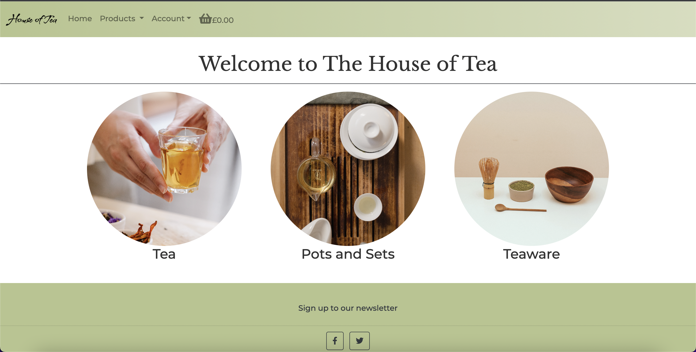

# House of Tea

# Introduction

admin: admin
Password: passyp1234

Houe of Tea is a site that allows users to browse and purchase traditional tea related products. It is styled to be inviting and simple to use, with a calming colour palette. House of Tea follows the convetions of a online wholesale store similar to [Art of Tea](https://wholesale.artoftea.com/) or [The Tea Spot](https://www.theteaspot.com/collections/top-selling-loose-tea).

 

# Features

## Existing Features

**Home Page**

From the home page users are able to navigate to the store, this is seperated into three seperate categories. The user is able to navigate to this using the 3 cards or via the nav bar at the top of the page. The mobile site was also designed to be bold and easy to use, but for quciker navigation the sticky nav bar has a drop down menu for easy access to any account settings or store pages.

 

**Navigation bar**

 

**Products Page**

 

**Product Info Page**

 

**Suppliers Page**

 

**Basket Page**

 

**Checkout Page**

 

**Card element**

 

**Checkout Success Page**

 

**Signup Page**

 

**Login Page**

 

**Signout Page**

 

**Footer**

 

## Features Left to Implement

 

**Quantity adjuster in Products Page**

 

**Newsletter Success page**

 

# Design Stage

## Buisness Model

The necessity for the inclusion of an e-commerce business model, highlighting the purpose of the application as either B2B or B2C focused, and detailing the core business intents and marketing strategies for the application.

## wireframes 

## UX

### Layout

### fonts

### Colour and Styling:

### Search Engine Optimization

## User Stories

1. As a user I should to be able to sign in and out of a personal account so I can control what information I provide
2. As a User I want to be able to browse a selection of related tea products.
3. As a user I want to be able to select what items and the amount I can purchase
4. As a user I want to be able to purchase items
5. 

 

# Designing the Database Models

https://app.diagrams.net/

# Testing

[Testing is documented in TESTING.md](TESTING.md)

# Deployment

### Downloaded Requirements
asgiref==3.5.0
cloudinary==1.29.0
dj-database-url==0.5.0
dj3-cloudinary-storage==0.0.6
Django==3.2
django-allauth==0.49.0
django-autoslug==1.9.8
django-crispy-forms==1.14.0
django-summernote==0.8.20.0
gunicorn==20.1.0
oauthlib==3.2.0
psycopg2==2.9.3
PyJWT==2.3.0
python3-openid==3.2.0
pytz==2021.3
requests-oauthlib==1.3.1
sqlparse==0.4.2

# Credits
Code Institute P5 Boutique Ado tutorial

Basket layout
https://bootstrapious.com/p/bootstrap-shopping-cart

Inspiration
https://www.teashop.com/black-tea-irish-cream-tea

Adjust increase and decrease button 
https://www.youtube.com/watch?v=TVA5NxD89-M&ab_channel=MediaUpload

When adding an item to basket redirected to main shopping bag page - should stay on page

Footer bootstrap
https://mdbootstrap.com/snippets/standard/mdbootstrap/2884987?view=side

Django All Auth:
- https://django-allauth.readthedocs.io/en/latest/installation.html

## Technologies Used

### Languages
HTML
CSS
Python
Javascript

### Frameworks
Django
Bootstrap

### Hosting
ElephantSql
Render
Amazon Web Services

## Content

pexels.com
googlefonts.com
fontawesome.com
dbdiagram.io

## Media

All pictures were taken from the open source site Pexels https://www.pexels.com/