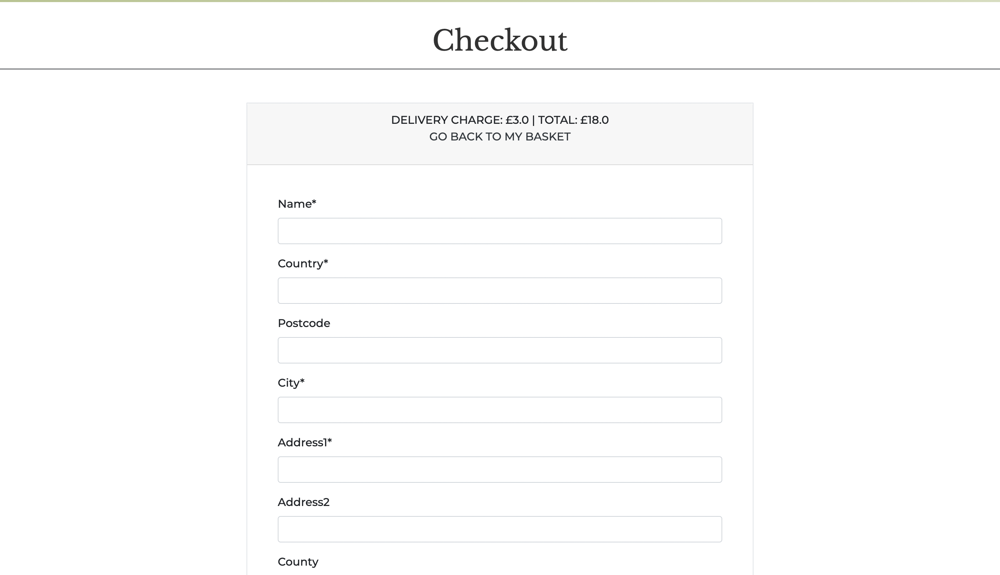
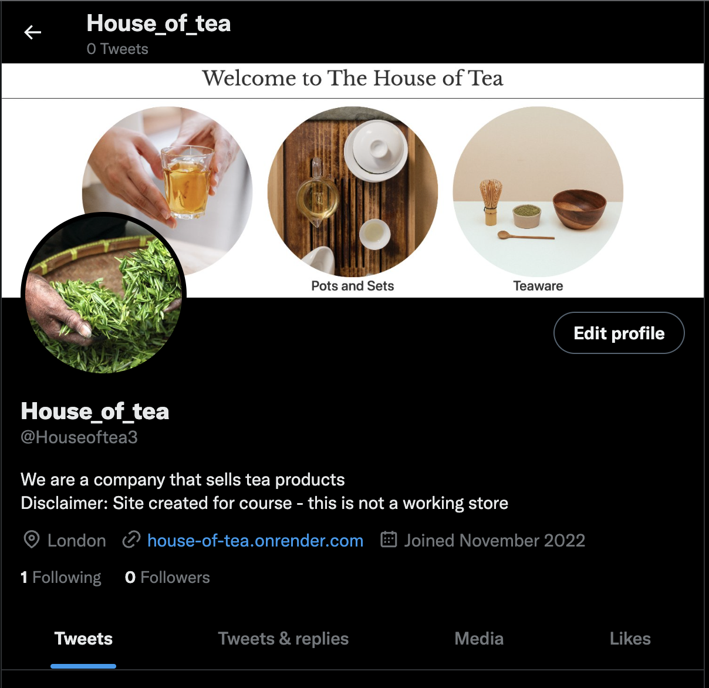

# House of Tea

# Introduction

admin: admin
Password: passyp1234

Houe of Tea is a site that allows users to browse and purchase traditional tea related products. It is styled to be inviting and simple to use, with a calming colour palette. House of Tea follows the convetions of a online wholesale store similar to [Art of Tea](https://wholesale.artoftea.com/) or [The Tea Spot](https://www.theteaspot.com/collections/top-selling-loose-tea). 

 

# Features

## Existing Features

**Home Page**

From the home page users are able to navigate to the various product pages, these are seperated into three categories. The user is able to navigate to this using the three card images, the text links or via the nav bar at the top of the page. The mobile site was also designed to be bold and easy to use, but for quciker navigation the sticky nav bar has a drop down menu for easy access to any account settings or store pages.

**Navigation bar**

Users can also access the all auth features to register, sign in and out and the account page.

 

**Products Page**

There are three speperate store pages, 'Tea', 'Pots and Sets' and 'Teaware'. This will allow users to narrow down their search as there could be far too many items for them to comfortably navigate. Currently this is not an issue as there are only a few items to demonstrate functionality, but as the admin can either add items via the terminal or update the fixtures files this is very easy to do.

 

**Product Info Page**

The product info page allows users to view a larger image of what they are purchasing with a full view of the text, as the products page cards require you to scroll in order to save space. The product info page also provides quantity adjusters to make amendments a little easier.

 

**Suppliers Page**

The suppliers page shows users where the products come from, currently as these are fictional companies they do not have links to any sites. If this site was intended to be launched to the public then links could easily be provided in a similar maner to the home page.

 

**Basket Page**

Allows users to see what items they have selected for purchase and the cost. 

The user can adjust the quanity here in the basket, as well as remove items easily.

 

**Checkout Page**

Checkout page allows users to pay for their items safely with Stripe. The users delivery information can be inputted here, including email and telephone number.

The user can input their card details at the bottom of the form.

 

**Checkout Success Page**

The chekout success page shows users their order number and confirms that their payment has been accepted.

 

**Signup Page**

Users are able to signup using all auth functionality.

 

**Login Page**

Users are able to login using all auth functionality.

 

**Signout Page**

Users are able to logout using all auth functionality.

 

**Footer**

The footer contains links to social media sites so that users can interact with the brand. This will increase the brand awareness for other potential customers.

**Social Media**

 

## Features Left to Implement

 

**Quantity adjuster in Products Page**

The quantity adjuster is currently only used in the product info and checkout pages, this could be a good feature to include in the products page. Originally this was left out as it might clutter the layout, since there is not much space to work with. However this could be adjusted for in the future.

 

**Newsletter Success page**

As described in the [TESTING.md](TESTING.md) document this feature was left out as it was unusually causing some issues. Some more time could be taken to amend this, as it will provide users with a more visual indication that they have signed up for the newsletter.

 

# Design Stage

## Buisness Model

This site was designed specifically as B2C business, catering for regular customers looking to purchase a lower quantity, but higher quality of product. User can see where these products are sourced from which gives transparency and cultivates trust with the customer. The presence of the store would be purely online as this is generally the preferred method of purchase, allows for a wider customer base to be reached and lowers costs by not requiring a physical shop.

## wireframes 

**Desktop**

**Mobile**

## UX

### Layout

### fonts

Fonts were taken from [Google Fonts](https://fonts.google.com/knowledge). The fonts selected are:

* Kolker Brush
* Libre Baskerville
* Montserrat

Kolker Brush was selected for the logo as it is very distinctive and reminiscent of brush stroke in Asian calligraphy, a region famous for tea.

Libre Baskerville was selected as a serif font gives a classy look, without using the standard Time New Roman which is often overused.

Montserrat was selected as it is a very clean text that is easy to read, this makes it ideal for large blocks of text.

### Colour and Styling:

Colours were selected using [coolers](https://coolors.co/) as it is a very fast way of gauging if colours will work well together on a website. Some slight adjustments were made to the colour choice, for example the navbar uses a subtle gradient to add visual impact. These colours were picked as they are calming, which is necessary when customer may be returning frequently or spending a long time browsing the site.

### Search Engine Optimization

## User Stories

1. As a user I should to be able to sign in and out of a personal account so I can control what information I provide
2. As a User I want to be able to browse a selection of related tea products.
3. As a user I want to be able to select what items and the amount I can purchase
4. As a user I want to be able to purchase items
5. 

 

# Designing the Database Models

## Categories Model

 

## Contact Model**

 

## Newsletter Model

 

## Order Line Item Model

 

## Order Model

 

## Product Model

 

## Supplier model

 

# Testing

[Testing is documented in TESTING.md](TESTING.md)

# Deployment

## Make sure you have installed these dependencies in a requirements.txt file

you can install these individually and create the requirements file using the command pip3 freeze > requirements.txt in the git terminal - this will copy all the dependencies for you

asgiref==3.5.2
boto3==1.26.16
botocore==1.29.16
dj-database-url==0.5.0
Django==3.2
django-allauth==0.41.0
django-crispy-forms==1.14.0
django-storages==1.13.1
gunicorn==20.1.0
jmespath==1.0.1
oauthlib==3.2.2
Pillow==9.3.0
psycopg2==2.9.5
python3-openid==3.2.0
pytz==2022.6
requests-oauthlib==1.3.1
s3transfer==0.6.0
sqlparse==0.4.3
stripe==5.0.0
whitenoise==6.2.0

Create Stripe API keys following these steps

1. Open the API keys page.
2. Click Create secret key.
3. Enter a name in Key name.
4. Click Create.

A through explination can be found [here](https://stripe.com/docs/keys).

## Render 

This site was deployed via [Render](https://dashboard.render.com/#), the steps to deploy are very similar to deploying to Heroku.

Go to Render and sign up to an account.

Once you have an account you can click the New + button in the top right hand coner, click Web Service and connect it to your Github repo, you will be requested to authorise this with Github as it will need to be installed.

You will need to add Render to your allowed hosts so it should look similar to this:

ALLOWED_HOSTS = ['localhost', 'house-of-tea.onrender.com']

## ElephantSql 

For the database we will use [ElephantSql](https://www.elephantsql.com/), sign up to an account and select the option Get a managed database today. You will also need to authorise with Github.

Go through the steps to create a team, providing a name and email address and set GDPR to yes. Now you can create a new instance. You are not required to provide tags for this step.

Select the nearest data center to you.

Go back to the main dashboard and you will be able to see the instace you have created, this will include a PostgreSQL URL.

Back in Github you will need to create a build.sh file in the root directory with the following code.

set -o errexit
pip install -r requirements.txt
python manage.py collectstatic --noinput
python manage.py makemigrations && python manage.py migrate

## Create an env.py file with the following code

!anything can be used here for the key just make sure not to share it with anyone

import os

os.environ["SECRET_KEY"] = "a_random_string_of_code" 

## Amzon Web Services 

You will need to sign up to Amzon Web Services or AWS [here](https://aws.amazon.com/).

Once signed in you can search for S3 in the search bar, When you open this page you can click + Create Bucket to start.
You will be given a few options, most of which can be left as they are however you will need a unique name and will need to set the region nearst to you.

## Gunicorn

We will need to complete a few steps with Gunicorn. Use the command ./build.sh in the Git terminal, once this is running enter another command gunicorn <PROJECT_NAME>.wsgi:application (you do not need to add <>).

You will need to go back to Render and add Envrionment Variables which should include all of these:

AWS_SECRET_ACCESS_KEY -  - You can find this in Amazon Web Services
AWS_ACCESS_KEY_ID - You can find this in Amazon Web Services
DISABLE_COLLECTSTATIC - should be set to 1
SECRET_KEY - should be the key set in your env files
STRIPE_PUBLIC_KEY - Can be found in your Stripe Account under API keys
STRIPE_SECRET_KEY - Can be found in your Stripe Account under API keys
EMAIL_HOST_PASS - this is a secret key
EMAIL_HOST_USER - this is the email address you intend to send emails from
USE_AWS should be True

# Credits

[Code Institute](https://codeinstitute.net/global/)

[Bootstrap Basket layout](https://bootstrapious.com/p/bootstrap-shopping-cart)

Inspiration

[Teashop](https://www.teashop.com/black-tea-irish-cream-tea)
[Art of Tea](https://wholesale.artoftea.com/)
[The Tea Spot](https://www.theteaspot.com/collections/top-selling-loose-tea). 

[Adjuster buttons](https://www.youtube.com/watch?v=TVA5NxD89-M&ab_channel=MediaUpload)

[bootstrap Footer](https://mdbootstrap.com/snippets/standard/mdbootstrap/2884987?view=side)

[Django All Auth:](https://django-allauth.readthedocs.io/en/latest/installation.html)

## Technologies Used

### Languages
HTML
CSS
Python
Javascript

### Frameworks
[Django](https://www.djangoproject.com/)
[Bootstrap](https://getbootstrap.com/)

### Hosting
[ElephantSql](https://www.elephantsql.com/)
[Render](https://dashboard.render.com/#)
[Amazon Web Services](https://aws.amazon.com/)

### Content
[Pexels](https://www.pexels.com/)
[Google Fonts](https://fonts.google.com/knowledge)
[Font Awesome](https://fontawesome.com/)
[Crispy Forms](https://django-crispy-forms.readthedocs.io/en/latest/)

### Media
All pictures were taken from the open source site [Pexels](https://www.pexels.com/)